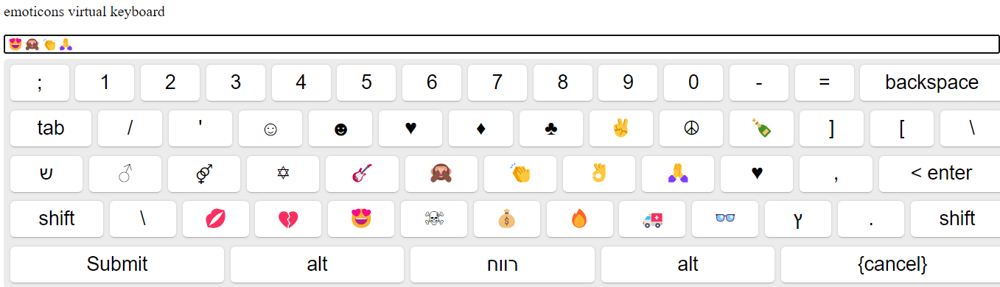

# Angular Virtual Keyboard
Hello everyone,
Our project provides a solution for displaying a virtual keyboard on the screen under the Angular platform

## Development server

Run `ng serve` for a dev server. Navigate to `http://localhost:4200/`. The application will automatically reload if you change any of the source files.

## 📦 Installation & Usage

### 1. `npm install virtual-keyboard-angular --save`

### 2.  adding  virtual-keyboard-angular packaged in app module and import him:
```
import { VirtualKeyboardModule } from 'yon-yon-virtual-keyboard';

@NgModule({
  declarations: [ ... ],
  imports: [
    CommonModule,
    VirtualKeyboardModule
  ]
})
export class AppModule { }
```

### 3. Adding 'vk-virtual-keyboard' & 'vk-search-result' elements right to html code:  
```
<vk-search-result [language]="'emo'" [items]="getSearchResult2()" [vk_id]="'items_search'"></vk-search-result>
<vk-search-result [language]="'emo'" [items]="getSearchResult1()" [vk_id]="'account_search'"></vk-search-result>
<p>We don't use with any validate and accept</p>
<vk-virtual-keyboard [language]="'en'"></vk-virtual-keyboard>
<p>We use with validate and accept</p>
<vk-virtual-keyboard [language]="'he'" [validateCallBack]="validate" [acceptCallBack]="accept"></vk-virtual-keyboard>
<p>We use with validateNumber and accept</p>
<vk-virtual-keyboard [language]="'he'" [validateCallBack]="validateNumber" [acceptCallBack]="accept"></vk-virtual-keyboard>
<p>With numeric</p>
<vk-virtual-keyboard [language]="'num'" [validateCallBack]="validateNumber" [acceptCallBack]="accept"></vk-virtual-keyboard>
<p>Custom Virtual Keyboard</p>
<vk-virtual-keyboard [keyboardLayout]="custom_Keyboard"></vk-virtual-keyboard>
<p>emoticons virtual keyboard</p>
<vk-virtual-keyboard [language]="'emo'"></vk-virtual-keyboard>
<p>VK with accept event that notify vk ID </p>
<vk-virtual-keyboard [language]="'en'" [acceptWithIDCallBack]="acceptWithVK_ID" [vk_id]="'007'"></vk-virtual-keyboard>

```

## Further help

We would like to thank some of the fathers of the projects we are building on and for us they are the cornerstones.

1. [Rob Garrison](https://github.com/Mottie/Keyboard) The father of all virtual keyboards, With his code we     defined  the whole issue of keyboards layout and keys events. 
2. [Francisco Hodge](https://github.com/simple-keyboard/angular-simple-keyboard) Our code is built on his code while performing analysis, modification and adaptation to the Angular platform  
